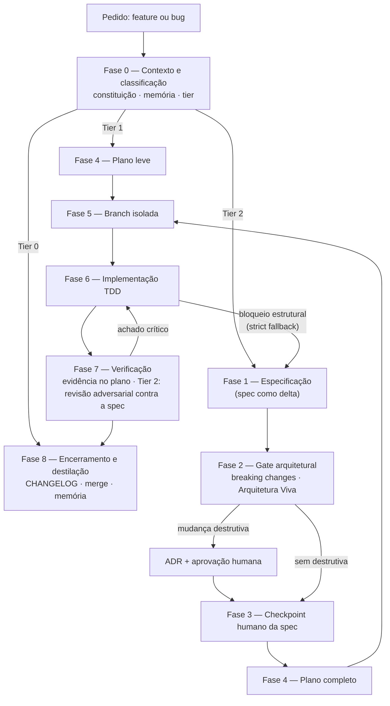

# sdd-lifecycle

**O motor de execução do Spec-Driven Development — uma skill agnóstica de agente que aplica
rigor proporcional ao risco.**

Uma skill que ensina qualquer agente de IA a conduzir o ciclo completo de uma mudança de
software: classificar o risco, especificar, planejar, implementar com TDD, provar com
evidência, revisar contra a spec e destilar o que foi aprendido. Companion do
[`sdd-scaffold`](https://github.com/thisco/sdd-scaffold): o scaffold instala a **estrutura** de
governança num repositório; esta skill executa o **processo** sobre ela.

[](LICENSE)
[](#contribuindo)
[](#dogfooding-este-repo-%C3%A9-governado-pela-pr%C3%B3pria-skill)
[](https://github.com/thisco/sdd-scaffold)

---

## O problema

Agentes de IA executam qualquer processo que você descrever — o difícil é descrever o processo
**certo**. Dois modos de falha dominam:

**Processo nenhum.** O agente recebe "implementa aí" e produz código que passa no teste da vez,
sem spec, sem plano, sem evidência. É o *vibe coding*: rápido hoje, arqueologia amanhã.

**Processo uniforme.** A reação comum é impor o pipeline completo — spec, checkpoint, plano,
revisão — a **toda** mudança. Um typo em documentação percorre as mesmas oito fases de uma
migração de schema. O custo é silencioso e corrosivo: como o rigor não cabe na mudança pequena,
o humano começa a driblar o processo, e a disciplina morre exatamente onde era barata. A
primeira versão desta skill tinha esse defeito.

Há ainda um terceiro problema, mais sutil: processos de agente costumam nascer **presos a um
ecossistema** — dependem de um plugin específico, de skills de um fornecedor, de um formato
proprietário. Trocar de ferramenta significa perder o processo.

## O modelo

A skill resolve os três com um desenho de quatro movimentos:

**1. Rigor proporcional (Fase 0 + matriz de tiers).** Toda mudança começa pela mesma fase de
contexto — ler a constituição do repo, ler a memória do projeto, classificar o risco — e a
classificação decide o caminho: **Tier 0** (trivial) vai direto ao commit; **Tier 1** (pequeno)
ganha plano leve, TDD e verificação; **Tier 2** (feature/estrutural) percorre o ciclo completo
com spec, gate arquitetural, checkpoints humanos e revisão adversarial. Critérios objetivos,
"na dúvida, tier mais alto", e escalação obrigatória se a mudança pequena revelar impacto
estrutural.

**2. Portões humanos onde errar é caro.** Mudanças destrutivas (contrato de API, schema,
interface pública) bloqueiam o fluxo até existir uma ADR aprovada por humano. A spec inteira
passa por checkpoint humano antes de virar plano. O resto flui sem fricção.

**3. Prove-it e revisão adversarial.** Nenhuma tarefa fecha sem evidência colada no plano
(saída de testes e lint). Em Tier 2, um agente **independente** revisa a implementação **contra
a spec, não contra o diff** — partindo de cada requisito e verificando que foi entregue. Diff
review não enxerga ausência; revisão adversarial sim.

**4. Destilação de memória.** O merge não encerra o ciclo: conhecimento que virou permanente é
promovido ao steering ou a uma ADR, aprendizados operacionais vão para a memória do projeto, e
a spec é arquivada como histórico do delta. O projeto lembra o que aprendeu.

E tudo isso **autocontido e agnóstico**: cada fase traz instruções completas e critério de
saída; nenhuma skill externa, plugin ou modelo específico é pré-requisito. Modelos são
referidos por capacidade ("modelo eficiente", "modelo de raciocínio potente"), nunca por marca.

## O ciclo



## Instalação

A skill é um único arquivo (`SKILL.md`) na raiz deste repositório — o nome do repo é o nome da
skill, então um clone direto no diretório de skills instala tudo.

**Claude Code (skill pessoal):**

```bash
git clone https://github.com/thisco/sdd-lifecycle.git ~/.claude/skills/sdd-lifecycle
```

**Claude Code (skill de projeto, versionada com o repo):** clonar um repo git dentro do seu
projeto criaria um repo aninhado; copie só o conteúdo, ou use submódulo se preferir rastrear
a origem:

```bash
git clone --depth 1 https://github.com/thisco/sdd-lifecycle.git /tmp/sdd-lifecycle \
  && mkdir -p .claude/skills/sdd-lifecycle \
  && cp /tmp/sdd-lifecycle/SKILL.md .claude/skills/sdd-lifecycle/
```

**Gemini CLI, Copilot e outros agentes:** referencie o `SKILL.md` como instrução de contexto —
por exemplo, importando-o no arquivo de instruções do agente (`GEMINI.md`,
`.github/copilot-instructions.md`) ou colando o caminho no prompt:
*"Siga o processo descrito em `sdd-lifecycle/SKILL.md` para esta mudança."*
A skill não usa nenhum recurso específico de plataforma; qualquer agente que leia markdown
consegue executá-la.

Para atualizar: `git -C ~/.claude/skills/sdd-lifecycle pull`.

## Uso

Invoque a skill nomeando-a no pedido:

> Use a `sdd-lifecycle` para implementar a exportação assíncrona de relatórios.

> Use a `sdd-lifecycle` para corrigir o cálculo de fuso horário no agendador.

A Fase 0 classifica o tier e anuncia o caminho. Você intervém nos checkpoints (aprovação de
spec, ADRs de mudanças destrutivas) e recebe, ao final, o plano com evidências e a revisão
registrada.

## Exemplos guiados

Dois walkthroughs completos, com todos os artefatos que a skill produz num projeto fictício:

- [`docs/exemplos/exemplo-tier-1.md`](docs/exemplos/exemplo-tier-1.md) — bug fix Tier 1:
  classificação, plano leve, ciclo TDD, evidência e encerramento.
- [`docs/exemplos/exemplo-tier-2.md`](docs/exemplos/exemplo-tier-2.md) — feature Tier 2:
  spec como delta, gate arquitetural, checkpoint humano, plano completo, revisão adversarial
  (com um achado real de requisito esquecido) e destilação.

## Relação com o sdd-scaffold

| | [`sdd-scaffold`](https://github.com/thisco/sdd-scaffold) | `sdd-lifecycle` (este repo) |
|---|---|---|
| **O que é** | Gerador de estrutura de governança | Skill de processo para agentes |
| **Instala** | `AGENTS.md`, steering, memória, Arquitetura Viva, CI | O ciclo de execução: tiers, fases, gates |
| **Quando usar** | Ao criar um projeto novo | A cada mudança, em qualquer projeto |
| **Sozinho** | Funciona (governança sem skill) | Funciona (skill com defaults próprios) |
| **Juntos** | A skill reconhece os artefatos do scaffold e os usa em cada fase | |

A skill é **scaffold-aware com degradação graciosa**: num repo gerado pelo scaffold ela lê a
constituição, segue a tabela de roteamento de steering, respeita os critérios de tier do
projeto, executa o drift check da Arquitetura Viva e destila para a memória. Num repo comum,
aplica seus defaults e funciona do mesmo jeito.

## Dogfooding: este repo é governado pela própria skill

- A evolução v1 → v2 foi feita seguindo o ciclo: veja a spec em
  [`docs/specs/2026-07-08-sdd-lifecycle-2-0.md`](docs/specs/2026-07-08-sdd-lifecycle-2-0.md) e o
  plano com evidências e revisão adversarial em
  [`docs/plans/2026-07-08-sdd-lifecycle-2-0.md`](docs/plans/2026-07-08-sdd-lifecycle-2-0.md).
- O histórico git registra a transição: o primeiro commit contém a v1 (fluxo linear, em inglês);
  `git diff` entre ele e a `main` mostra exatamente o que o SDD 2.0 mudou no processo.
- `CHANGELOG.md` segue Keep a Changelog; commits seguem Conventional Commits; a
  mini-constituição do repo está em [`AGENTS.md`](AGENTS.md).

## Origem

A skill nasceu orquestrando o desenvolvimento de um projeto real em produção — um pipeline
multi-cloud com mais de mil testes automatizados e dezenas de ADRs — e foi generalizada aqui
junto com o modelo de governança que a acompanha (o `sdd-scaffold`). A primeira versão
orquestrava skills do ecossistema [Superpowers](https://github.com/obra/superpowers); a versão
atual é autocontida, mas aquelas skills seguem funcionando como aceleradores opcionais.

## Referências

- [OpenSpec](https://github.com/Fission-AI/OpenSpec) — specs como fonte de verdade para agentes.
- [GitHub Spec Kit](https://github.com/github/spec-kit) — toolkit de Spec-Driven Development.
- [Padrão AGENTS.md](https://agents.md/) — convenção aberta para arquivo de instruções de agentes.
- [Superpowers](https://github.com/obra/superpowers) — ecossistema de skills que inspirou a v1.
- [Anthropic Engineering — Claude Code best practices](https://www.anthropic.com/engineering/claude-code-best-practices) — práticas de engenharia com agentes.
- [Anthropic Engineering — Context engineering](https://www.anthropic.com/engineering/effective-context-engineering-for-ai-agents) — engenharia de contexto para agentes.
- [Test-Driven Development by Example — Kent Beck](https://www.oreilly.com/library/view/test-driven-development/0321146530/) — o ciclo vermelho-verde-refatora.
- [Architecture Decision Records — Michael Nygard](https://cognitect.com/blog/2011/11/15/documenting-architecture-decisions) — o formato ADR.
- [Keep a Changelog](https://keepachangelog.com/pt-BR/1.1.0/) — formato de changelog adotado.
- [Conventional Commits](https://www.conventionalcommits.org/pt-br/v1.0.0/) — convenção de mensagens de commit.

## Licença

Distribuído sob a licença [MIT](LICENSE). Copyright (c) 2026 Thiago Oliveira.

## Contribuindo

Contribuições são muito bem-vindas. Abra uma *issue* para propor melhorias ou discutir o
processo, e mande *pull requests* — de correção de typo (Tier 0!) a mudanças no ciclo (Tier 2,
com spec — pratique o que o repo prega). Para mudanças estruturais, descreva a motivação e o
impacto no processo.
